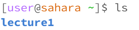
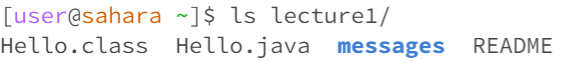
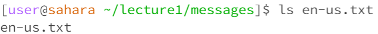
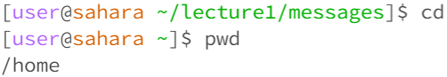
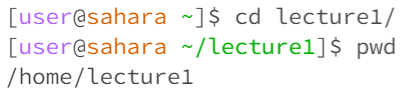
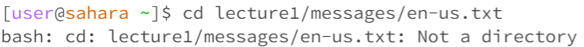
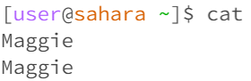
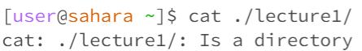
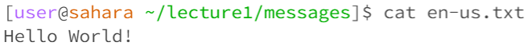

**1**

  

The working directory is home directory "/home".  
I am getting this output because ls will list out files and directories this current directory contains.  
The output is not an error.  

**2**  

  
The working directory is still home directory "/home".  
I am getting this output because "ls lecture1/" lists out files and directories within the lecture1 directory.  
The output is not an error.  

**3**  
  
The working directory is /home/lecture1/messages.  
I am getting this ouput because ls command simply confirms that this file exits by displaying its name.   
The output is not an error.  

**4**  
  
The working directory is /home/lecture1/messages  
The cd command brings me back to the home directory because I did not give it any argument  
The output is not an error.

**5**  
   
The working directory is home directory "/home".  
The cd command changes my directory to the lecture1 directory.  
The output is not an error.

**6**  
   
The working directory is home directory "/home".  
The cd command tries to change my directory to a file but it cannot do it because it only works for changing directories not a specifc file.  
The output is an error because I was trying to change directory to a file.  

**7**  
   
The working directory is home directory "/home".   
cat command is used to concatenate and display files' contents. When there is no argument, it waits for user input. After I typed in my name, cat
command displayed it. 
It is not an error, the cat command requires inputs (can be words or lines) and displays the inputs.  

**8**  
   
The working directory is home directory "/home".  
cat command is used to display contents of files. Therefore, when the argument is a directory, cat cannot run properly.  
This is an error, cat only takes files as input to concatenate or display the contents.  

**9**  
   
The working directory is /home/lecture1/messages   
cat command is used to display contents of files so it shows the message within the en-us.txt file.  
The output is not an error.   

